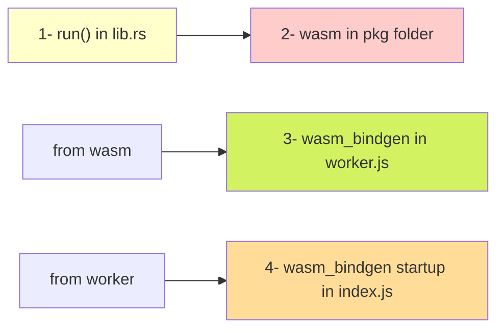

In Rust's WebAssembly (`wasm-bindgen`) environment, a `Closure` is used to create JavaScript callbacks that can be passed to the browser's JavaScript engine and invoked from JavaScript. The `wasm-bindgen` crate provides the `Closure` type, which wraps Rust functions and closures so that they can be passed into JavaScript.

### Visualisation



#### Background

In WebAssembly, Rust's native closures or function pointers cannot directly interact with JavaScript functions or DOM events. Instead, `wasm-bindgen` provides a `Closure` type that can wrap a Rust function or closure and convert it into a form that JavaScript can call. This is particularly useful for setting up event listeners in web development.

When you use a `Closure`, you need to "leak" it to prevent it from being dropped by Rust's memory management (since JavaScript might try to call it later). The `Closure` will be automatically cleaned up when the page is unloaded, or you can explicitly manage its lifetime.

### Example: Using `Closure` in Rust WebAssembly

Here is a simple example that demonstrates how to use `Closure` to set up an event listener for an HTML element:

#### Rust Code (`lib.rs`)

This code sets up an `oninput` event listener on an HTML input element using a Rust `Closure`:

```rust
use wasm_bindgen::prelude::*;
use wasm_bindgen::JsCast;
use web_sys::{console, window, HtmlInputElement};

// Entry point for the WASM module
#[wasm_bindgen(start)]
pub fn run() {
    // Get the window and document objects
    let window = window().unwrap();
    let document = window.document().unwrap();

    // Get the input element by its ID
    let input_element = document.get_element_by_id("my_input").unwrap();
    let input_element = input_element.dyn_into::<HtmlInputElement>().unwrap();

    // Create a new closure that logs a message to the console
    let callback = Closure::wrap(Box::new(move || {
        console::log_1(&"oninput callback triggered".into());
    }) as Box<dyn FnMut()>);

    // Set the closure as the input event listener
    input_element.set_oninput(Some(callback.as_ref().unchecked_ref()));
e
    // Prevent Rust from deallocating the closure by "leaking" it
    callback.forget();
}
```

### Explanation

1. **Import Required Libraries**:
   
   - `wasm_bindgen::prelude::*`: Required for using `wasm_bindgen` macros.
   - `wasm_bindgen::JsCast`: Provides the `dyn_into` method for casting JavaScript values.
   - `web_sys`: Provides access to browser APIs, such as the `console` and `HtmlInputElement`.

2. **Getting the DOM Elements**:
   
   - Use `window().unwrap()` to get the global `window` object.
   - Get the `document` from the `window`.
   - Use `document.get_element_by_id("my_input").unwrap()` to get the input element by its ID.

3. **Creating a `Closure`**:
   
   - `Closure::wrap` is used to create a closure that logs a message to the console when the input event is triggered. The closure is boxed and cast to `Box<dyn FnMut()>` because `wasm-bindgen` requires closures to be `'static` (i.e., live for the entire duration of the program) and to implement the `FnMut` trait.

4. **Setting the Event Listener**:
   
   - `input_element.set_oninput(Some(callback.as_ref().unchecked_ref()))` sets the closure as the `oninput` event listener for the input element.
   - `callback.as_ref().unchecked_ref()` converts the closure reference into a raw JavaScript function pointer.

5. **Preventing Memory Deallocation**:
   
   - `callback.forget()` is called to "leak" the closure, which prevents Rust from deallocating it. This is necessary because the closure might be called by JavaScript after the Rust code has returned, and Rust's borrow checker cannot ensure the safety of this memory usage.

### HTML Code (`index.html`)

To test the Rust WebAssembly code, you need an HTML file with an input element:

```html
<!DOCTYPE html>
<html lang="en">
<head>
    <meta charset="UTF-8">
    <meta name="viewport" content="width=device-width, initial-scale=1.0">
    <title>Closure Example in WASM</title>
</head>
<body>
    <input type="text" id="my_input" placeholder="Type something...">
    <script type="module" src="index.js"></script>
</body>
</html>
```

### JavaScript Code (`index.js`)

The JavaScript code to initialize the WASM module:

```javascript
import init from './pkg'; // Adjust path as needed
init().then(() => {
  console.log("WASM module initialized");
}).catch(console.error);
```

You're right! Here's a corrected version of the `worker.js` file for handling WebAssembly via `wasm_bindgen` in a more direct worker environment:

### `worker.js` (Web Worker):

```javascript
// Import the wasm_bindgen module that has been generated by Rust's wasm-bindgen
self.importScripts('pkg/your_wasm_package.js');

// Initialize the WASM module using wasm_bindgen
wasm_bindgen('pkg/your_wasm_package_bg.wasm')
  .then(() => {
    console.log("WASM loaded in worker");

    // Example: you can call exported Rust functions from here
    const result = wasm_bindgen.your_exported_function();
    self.postMessage({ result });
  })
  .catch(console.error);

// Listen for messages from the main thread
self.onmessage = function (event) {
  // Perform actions with the event data here
  console.log(event.data);
};
```

### Explanation:

- `self.importScripts` loads the generated `wasm_bindgen` JavaScript glue code.
- It uses `wasm_bindgen` to initialize the WASM module, pointing to the `.wasm` file.
- `self.onmessage` is used to handle messages from the main thread.
- You can call Rust-exported functions via `wasm_bindgen` and post results back using `self.postMessage`.

Make sure to adjust the file paths to match your project.

### Conclusion

With this setup, when you type into the input field in the browser, the console will log `oninput callback triggered` each time the input changes. This demonstrates how to use `Closure` to create an event listener in Rust for WebAssembly.
